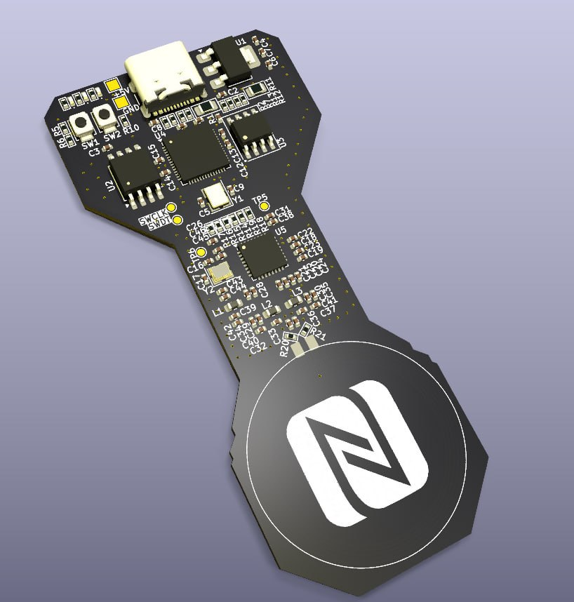
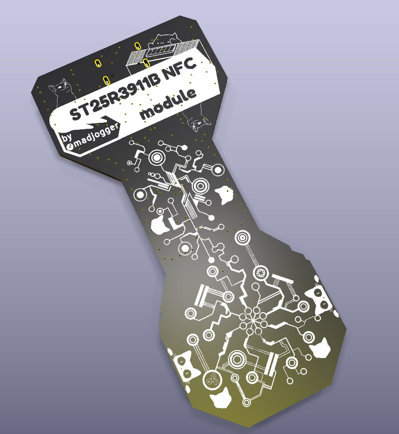

# ST25R3911B-NFC-module

**NFC-модуль на высокопроизводительном HF-ридере ST25R3911B с управлением от RP2040 и антенной на плате.**

Плата NFC-ридера на чипе **ST25R3911B** (STMicroelectronics) — это заметно более функциональное решение, чем популярные бюджетные модули (PN532, RC522): высокая выходная мощность, поддержка VHBR, автоматическая подстройка антенны и ёмкостный wake-up. Логику и интерфейс берёт на себя **RP2040**, антенна разведена прямо на плате с соблюдением всех рекомендаций ST по согласующим и фильтрующим цепям. После отладки модуль можно смело переиспользовать как ВЧ-фронтенд в составе больших систем.

## Обзор

- **Название проекта:** ST25R3911B-NFC-module
- **Ридер:** STMicroelectronics ST25R3911B — высокопроизводительный HF reader / NFC initiator (13.56 МГц)
- **Микроконтроллер:** Raspberry Pi RP2040
- **Интерфейс ридер ↔ МК:** SPI
- **Антенна:** на плате, с согласующими и фильтрующими цепями по рекомендациям ST
- **Назначение:** отладка ST25R3911B и использование как ВЧ-фронтенда в больших системах

## Ключевые особенности

- **Мультипротокольный HF-ридер** — ISO14443A, ISO14443B (включая высокие битрейты / VHBR), ISO15693, ISO18092 (NFCIP-1, инициатор и активная цель), FeliCa; MIFARE Classic через AFE и framing на стороне МК
- **Высокая выходная мощность** — до 1.4 Вт, два дифференциальных низкоомных (1 Ω) драйвера антенны → большая дальность считывания
- **Автоматическая подстройка антенны (AAT)** — оптимизация под напрямую подключённую антенну
- **Ёмкостный wake-up** — детектирование присутствия карты без включения ВЧ-поля (низкое энергопотребление), плюс детект по амплитуде/фазе
- **Встроенный АЦП** — измерение амплитуды и фазы сигнала на антенне, калибровка
- **Антенна на плате** — разведена с соблюдением рекомендаций ST по фильтрам и согласованию
- **Управление от RP2040** — двухъядерный Cortex-M0+ для логики и обработки

## Что на плате

| Блок | Компонент | Назначение |
|---|---|---|
| NFC-ридер | ST25R3911B | HF reader / NFC initiator, 13.56 МГц |
| Микроконтроллер | RP2040 | Управление, обработка, интерфейс с хостом |
| Антенна | PCB-антенна | Дифференциальная антенна на плате |
| Согласование/фильтры | EMC-фильтр + matching | Цепи по рекомендациям ST (AAT) |
| Интерфейс | USB | Питание и связь с хостом |

## Технические характеристики

| Параметр | Значение |
|---|---|
| Ридер | STMicroelectronics ST25R3911B |
| Рабочая частота | 13.56 МГц |
| Протоколы | ISO14443A/B (+VHBR), ISO15693, ISO18092 (NFCIP-1), FeliCa |
| Выходная мощность | до 1.4 Вт (дифференциальная антенна) |
| Драйверы антенны | 2× дифференциальные, 1 Ω |
| Доп. функции | AAT, ёмкостный wake-up, встроенный АЦП |
| Интерфейс ридера | SPI |
| Микроконтроллер | RP2040, 2× Cortex-M0+ до 133 МГц |
| Питание ридера | 2.4 … 5.5 В |

## Антенна

Антенна выполнена непосредственно на печатной плате. Согласующие и фильтрующие цепи (EMC-фильтр между драйвером и антенной, цепи подстройки) разведены с соблюдением рекомендаций STMicroelectronics, что в связке с автоматической подстройкой антенны (AAT) обеспечивает стабильную работу ВЧ-тракта.

## Применение

- Считыватель карт и меток NFC/RFID (контроль доступа, тикетинг)
- ВЧ-фронтенд для интеграции в большие системы
- Отладка и изучение многопротокольного NFC-ридинга
- Промышленные, медицинские и потребительские NFC-приложения

## Среда разработки

- **Схема и плата:** KiCad
- **Прошивка:** PlatformIO / Arduino / Pico SDK (RP2040), драйвер ST25R3911B (ST RFAL)
- **Документация на компоненты:** datasheet ST25R3911B (ST), RP2040 (Raspberry Pi)
